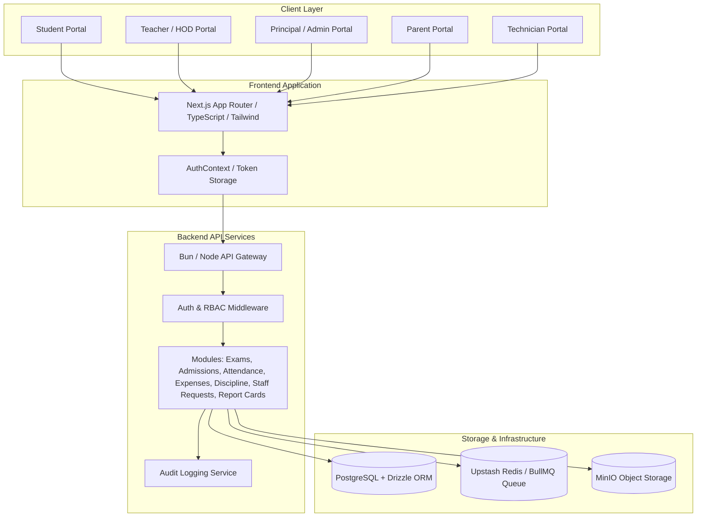
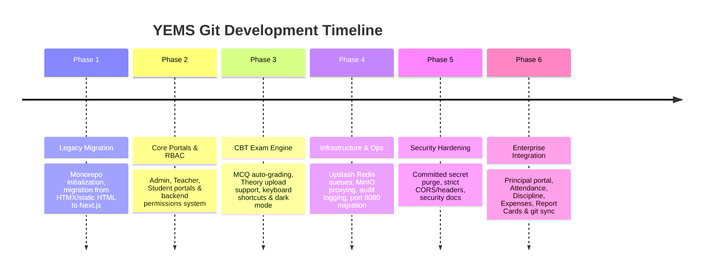

# YEMS Codebase Progress Report

**Project Name:** Yeshua Educational Management System (YEMS)  
**Repository:** `dev-dami/Yeshua-Educational-Management-System`  
**Current Branch:** `main`  
**Latest Commit:** `13e54c7` (Merge remote-tracking branch `origin/main`)  
**Date:** August 9, 2026  

---

## 1. Executive Summary

The **Yeshua Educational Management System (YEMS)** is an enterprise-grade school management and Computer-Based Testing (CBT) platform. Over the course of **140+ git commits**, YEMS has evolved from legacy static HTML/HTMX prototypes into a production-ready **TypeScript monorepo** with a Next.js frontend, a Bun/Elysia Node-compatible backend, Drizzle ORM PostgreSQL integration, and an asynchronous queue architecture powered by Upstash Redis and BullMQ.

### Key Highlights:
- **7 Complete Persona Portals**: Student, Teacher, Parent, Admin, Principal, HOD, and Technician.
- **Computer-Based Testing (CBT) Engine**: Real-time MCQ & Theory exam delivery, keyboard shortcuts (A/B/C/D, N/P navigation), retake prevention, time-locking, automatic objective grading, and theory submission review workflows.
- **Enterprise School Administration**: Comprehensive attendance tracking, discipline escalation, expense approval workflows, staff requests, dynamic class streams, and automated report card generation.
- **Infrastructure & Security**: Production port migration (`8080`), audit log service, MinIO image proxying, secret sanitization, Docker containerization, and security posture docs (`SECURITY_BREACH_NOTICE.md`, `CODE_REVIEW.md`).

---

## 2. System Architecture & Tech Stack

### Core Technologies
- **Monorepo Management**: npm / Bun workspaces (`packages/frontend`, `packages/backend`, `packages/browser`).
- **Frontend Framework**: Next.js (App Router), React 19, TypeScript, Vanilla/Tailwind CSS styling with theme-aware tokens (Light/Dark modes).
- **Backend Framework**: Node.js / Bun with modular HTTP controllers, Zod schema validation, and custom permission middleware.
- **Database & ORM**: PostgreSQL paired with Drizzle ORM for type-safe schema definitions and migration control.
- **Asynchronous Task Processing**: Upstash Redis integration with BullMQ fallback for heavy jobs (e.g. background grading, bulk report generation).

---

## 3. Module & Capability Matrix

| Module | Backend Service & DB Schema | Frontend Portal UI | Key Capabilities | Status |
| :--- | :--- | :--- | :--- | :--- |
| **Authentication & RBAC** | `auth.service.ts`, `permissions.ts` | `/login` | Role-based token access, permission matrices for 7 user roles. | **Production** |
| **Exams & CBT Engine** | `exams.*`, `submissions.*` | `/student/exams/[id]`, `/teacher/exams` | MCQ + Theory support, keyboard shortcuts, auto-grading, retake lock, result visibility control. | **Production** |
| **Student & Parent Portals** | `users.*`, `results.*` | `/student/*`, `/parent/*` | Grade cards, exam history, fee summaries, result masking controls. | **Production** |
| **Teacher & Submissions** | `notes.*`, `assignments.*`, `lesson-plans.*` | `/teacher/*` | Class teacher tools, scheme of work, lesson plan approvals, theory grading drawer. | **Production** |
| **Principal Portal** | `principal.service.ts` | `/principal/*` | High-level executive dashboard, financial alerts, academic oversight, staff activity metrics. | **Production** |
| **Attendance Tracking** | `attendance.repo.ts`, `schema/attendance.ts` | Integrated across dashboards | Class-by-class presence rate, daily summary alerts, historical trends. | **Production** |
| **Discipline Management** | `discipline.service.ts`, `schema/discipline.ts` | `/principal/discipline` | Incident recording, escalation level tracking, principal sign-off. | **Production** |
| **Expenses & Approvals** | `expenses.service.ts`, `schema/expenses.ts` | `/principal/approvals`, `/principal/financial` | Expense filing, threshold alert triggers, principal financial sign-off. | **Production** |
| **Report Cards** | `report-cards.service.ts`, `schema/report-cards.ts` | `/student/results`, `/principal/reports` | Termly score aggregation, weak/strong subject highlights, single-page print format. | **Production** |
| **Staff Requests** | `staff-requests.service.ts` | `/principal/approvals` | Leave & resource requests, approval status pipeline. | **Production** |
| **Technician & Monitoring** | `technician.*` | `/technician/*` | Real-time service status, device management, auto-refresh logs router. | **Production** |

---

## 4. Chronological Development Milestones

### Key Milestones Detailed

#### Milestone 1: Monorepo Foundation & Next.js Promotion
- Established monorepo workspace structure separating `frontend`, `backend`, and `browser` packages.
- Deprecated early HTML/HTMX prototypes (`packages/deprecated-frontend`) and promoted Next.js App Router as the canonical frontend.

#### Milestone 2: CBT Engine & Exam Experience Overhaul
- **Objective & Theory Support**: Built dual exam creation flows. Objective questions feature automated scoring, while theory exams support paper uploads and manual grading UI.
- **Ergonomics & Accessibility**: Added keyboard shortcuts (`A`/`B`/`C`/`D` selection, `N`/`P` navigation), dark/light mode toggle with theme tokens, and dynamic question status palette.
- **Security Controls**: Implemented retake prevention, anti-double-submission overlays, and student result visibility toggles controlled by admins/teachers.

#### Milestone 3: Infrastructure, Redis & Technician Observability
- Integrated Upstash Redis with a fallback mechanism for robust queuing (BullMQ workers for background submissions).
- Created a dedicated **Technician Portal** with live system statistics, service monitoring, device status tracking, and database log routing.
- Migrated default production server port from `4000` to `8080`.

#### Milestone 4: Security Hardening & Secret Remediation
- Conducted codebase security audits: removed hardcoded credentials, SSL key files (`yems.key`, `yems.crt`), and Redis dump files.
- Published `SECURITY_BREACH_NOTICE.md` detailing credential rotation procedures and `CODE_REVIEW.md` outlining architectural standards.
- Strengthened RBAC permissions (`permissions.ts`) for admin, teacher, HOD, and principal roles.

#### Milestone 5: Executive Principal Portal & Enterprise School Ops
- Added schema migrations (`0004` through `0010`) and service modules for:
  - **Attendance**: Class-level attendance rates and anomaly alerts.
  - **Discipline**: Escalation cases tracking.
  - **Expenses**: Threshold-driven financial sign-offs.
  - **Report Cards**: Restructured single-card student result view with automated class performance stats.
  - **Staff Oversight**: Activity signals tracking teacher schemes of work and lesson plan submissions.
- Merged remote `origin/main` changes cleanly to align remote snapshots with local history.

---

## 5. Security & Deployment Posture

> [!IMPORTANT]
> **Production Deployment Readiness Checklist**

- **Port Configuration**: Default API service bound to port `8080`. Frontend dev server runs on Next.js default (`3000`).
- **Containerization**: Frontend and backend equipped with optimized multi-stage `Dockerfile` and `docker-compose.yml`.
- **Media & File Handling**: Public images and exam attachments are safely served via MinIO proxy routes to prevent direct exposure.
- **Git Hygiene**: Clean `.gitignore` rules prevent tracking sensitive credentials, SQLite/Redis dumps, `.env` files, or CSV exports (`students.csv`).

---

## 6. Verification & System Health Status

- **Git Working Tree**: Clean (`nothing to commit, working tree clean`).
- **Branch Tracking**: Local `main` branch includes all 140+ historical commits plus remote updates from `origin/main`.
- **Database Schema**: Fully synchronized with Drizzle migrations up to `0010_add_notes_class.sql`.

---

## 7. Next Steps & Recommendations

1. **Automated End-to-End Tests**: Expand Playwright / Vitest suites covering full CBT exam sessions under network degradation.
2. **Secret Rotation**: Rotate any production tokens or database credentials that were historically referenced prior to sanitization.
3. **CI/CD Pipeline Setup**: Implement GitHub Actions workflows for continuous integration (typecheck, linting, build checks) on push to `main`.
